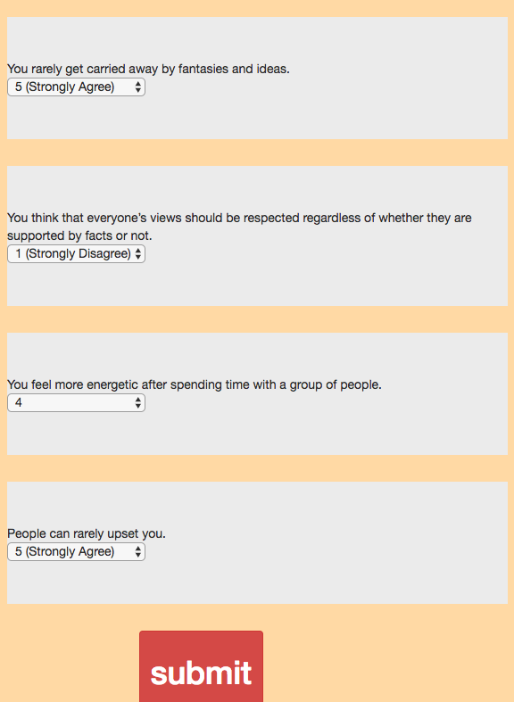

# friend-finder

##### A node application using express to make a dating application.

Instructions:

1) When the user is greeted with the home page and clicks on the "lets get started" button the user is taken to the survey    page.

2) The user has to fill out all fields and and has to enter an image url for the image field.

3) After sunbit button is pressed a match will appear which is done with an algorithm in the server-side code.

______________________________________________________________________________________________________________________________

here is the link to the live site: https://dry-temple-52828.herokuapp.com/
______________________________________________________________________________________________________________________________

Technologies Used:

1) NODE-JS
2) EXPRESS-JS
3) JQUERY
4) HTTP PROTOCOL
5) HTML/BOOTSRAP
6) CSS
______________________________________________________________________________________________________________________________
SCREENSHOTS:

